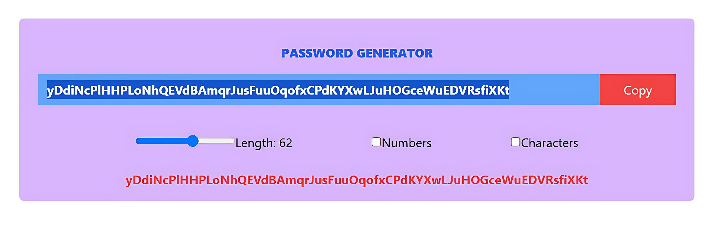

# Password Generator Webpage using React JS and Tailwind CSS

This is a simple **Password Generator App** built with React that allows users to generate secure, customizable passwords. The app provides options to set password length, include numbers, and add special characters, with a one-click copy functionality.

## Features

- Generate a random password with customizable length.
- Optionally include numbers and special characters.
- Copy the generated password to the clipboard with one click.

## Installation

1. Clone the repository:
   ```bash
   git clone https://github.com/Salehmangrio/password-Generator-Using-React-JS.git

2. Install dependencies
   ```bash
   cd password-Generator-Using-React-JS
   npm install


## Code Explanation

### 1. Importing React and Hooks
```javascript
import React, { useCallback, useEffect, useRef, useState } from "react";
```
- Imports React along with hooks (`useCallback`, `useEffect`, `useRef`, and `useState`) that manage component state, perform side effects, and interact with the DOM.

### 2. Component Initialization
```javascript
export default function App() {
```
- The main functional component `App` is declared and exported as the default export of this module.

### 3. State Variables
```javascript
let [password, setPassword] = useState("");
let [length, setLength] = useState(8);
let [numbersAllowed, setNumbersAllowed] = useState(false);
let [charactersAllowed, setCharactersAllowed] = useState(false);
```
- `password`: Holds the generated password.
- `length`: Sets the length of the password (default is 8).
- `numbersAllowed` and `charactersAllowed`: Toggle options to include numbers and special characters in the password.

### 4. Password Generation Function
```javascript
const passwordGenerate = useCallback(() => {
  let pass = "";
  let str = "ABCDEFGHIJKLMNOPQRSTUVWXYZabcdefghijklmnopqrstuvwxyz";
  if (numbersAllowed) str += "1234567890";
  if (charactersAllowed) str += "!@#$%^&*()_+~?:;|";
  for (let i = 0; i < length; i++) {
    let randNum = Math.floor(Math.random() * str.length);
    pass += str.charAt(randNum);
  }
  setPassword(pass);
}, [length, setPassword, numbersAllowed, charactersAllowed]);
```
- `passwordGenerate`: A function wrapped in `useCallback` for optimized re-rendering. This function:
  - Initializes a character set containing uppercase and lowercase letters.
  - Conditionally adds numbers and special characters to the character set based on `numbersAllowed` and `charactersAllowed`.
  - Generates a password of the specified `length` by appending random characters from the character set.
  - Updates the `password` state with the generated password.

### 5. Automatic Password Generation
```javascript
useEffect(() => {
  passwordGenerate();
}, [length, numbersAllowed, charactersAllowed]);
```
- `useEffect` automatically triggers `passwordGenerate` whenever the values of `length`, `numbersAllowed`, or `charactersAllowed` change, ensuring that the password updates with user settings.

### 6. Using Refs
```javascript
let passRef = useRef(null);
```
- `passRef` is used to reference the password input element. This allows us to select and copy the password to the clipboard programmatically.

### 7. UI Elements and Rendering
```javascript
return (
  <>
    <div className='m-10 bg-purple-300 pt-4 px-6 rounded-md'>
      <h1 className='text-center font-extrabold text-blue-600 uppercase p-4'>Password Generator</h1>
      <div className='flex'>
        <input
          type="text"
          className='w-full py-1 px-3 outline-none bg-blue-400 text-white font-bold'
          placeholder='Password'
          readOnly
          value={password}
          ref={passRef}
        />
        <button
          className='w-28 h-10 bg-red-500 text-white'
          onClick={() => {
            passRef.current?.select();
            window.navigator.clipboard.writeText(password);
          }}
        >
          Copy
        </button>
      </div>
```
- **Password Display**:
  - A readonly input field displays the generated password (`value={password}`).
  - `ref={passRef}` associates the input with `passRef`, enabling programmatic text selection.
- **Copy Button**:
  - On click, selects the password text and copies it to the clipboard.

```javascript
      <div className='flex justify-evenly mt-3 items-center p-6'>
        <div>
          <input
            type="range"
            min={8}
            max={100}
            value={length}
            onChange={(e) => setLength(e.target.value)}
          />
          <label>Length: {length}</label>
        </div>
        <div>
          <input
            type="checkbox"
            checked={numbersAllowed}
            onChange={() => setNumbersAllowed(prev => !prev)}
          />
          <label>Numbers</label>
        </div>
        <div>
          <input
            type="checkbox"
            checked={charactersAllowed}
            onChange={() => setCharactersAllowed(prev => !prev)}
          />
          <label>Characters</label>
        </div>
      </div>
      <h1 className="text-center font-bold pb-4 text-red-500">{password}</h1>
    </div>
  </>
);
```

- **Controls**:
  - **Password Length**: 
    - A range input slider (`type="range"`) adjusts the `length` state, controlling the password length.
  - **Include Numbers**: 
    - A checkbox toggles the inclusion of numbers in the password.
  - **Include Characters**: 
    - A checkbox toggles the inclusion of special characters.

- **Password Preview**:
  - Displays the current generated password as text below the controls.


# Tailwind CSS Classes Used

This project uses **Tailwind CSS** for styling, applying utility classes for layout, color, spacing, and typography to make the app visually appealing and user-friendly.

### Class Names and Descriptions

- `m-10`: Applies a margin of `2.5rem` around the component.
- `bg-purple-300`: Sets the background color to a light purple shade.
- `pt-4`, `px-6`: Adds padding at the top (`1rem`) and padding on the left and right (`1.5rem`) of the component.
- `rounded-md`: Applies medium rounding to the component's corners.
- `text-center`: Centers text within the element.
- `font-extrabold`: Makes the font weight extra bold.
- `text-blue-600`: Sets the text color to a dark blue shade.
- `uppercase`: Converts text to uppercase.
- `p-4`: Adds padding of `1rem` on all sides.
- `flex`: Creates a flex container to arrange child elements in a row.
- `w-full`: Sets the width to 100% of the parent element.
- `py-1`, `px-3`: Adds padding (`0.25rem` top/bottom, `0.75rem` left/right) to input elements.
- `outline-none`: Removes the default browser outline from input fields.
- `bg-blue-400`: Sets the background color of the input to a mid-tone blue.
- `text-white`: Sets the text color to white for better contrast.
- `font-bold`: Makes the font weight bold.
- `w-28`: Sets a fixed width of `7rem` for the button.
- `h-10`: Sets a fixed height of `2.5rem` for the button.
- `bg-red-500`: Applies a red background to the button.
- `justify-evenly`: Evenly spaces flex items along the main axis.
- `mt-3`: Adds a top margin of `0.75rem` to elements.
- `items-center`: Centers flex items along the cross-axis (vertically in a row).
- `p-6`: Adds padding of `1.5rem` on all sides.
- `text-red-500`: Sets the color of the generated password text to red for emphasis.
- `pb-4`: Adds padding of `1rem` to the bottom of the password preview text.

### Purpose

These classes define the layout, spacing, and color scheme of the app, ensuring a responsive and modern UI with minimal custom CSS.


## Project Summary

This **Password Generator App** is built using **React** and **Tailwind CSS**, combining the powerful state management and component structure of React with Tailwind’s utility-first CSS framework for rapid styling. The app allows users to generate a customizable password with options for length, inclusion of numbers, and special characters, along with a one-click copy feature.

### React
- **State Management**: Utilizes `useState` to manage password details, such as length, and inclusion options for numbers and special characters.
- **Dynamic Password Generation**: A memoized function (`useCallback`) generates a password string based on user input, and an `useEffect` hook automatically updates the password when any user-defined setting changes.
- **DOM Manipulation**: `useRef` is used to enable direct interaction with the input field, allowing text selection and clipboard copying.

### Tailwind CSS
- **Responsive Layout and Styling**: Tailwind's utility classes handle the entire styling, providing a clean and responsive UI with minimal CSS. Classes like `flex`, `justify-evenly`, and `items-center` enable an easy layout configuration, while color and spacing utilities (`bg-purple-300`, `m-10`, `p-4`) add visual appeal.
- **Customizable Components**: Tailwind classes help create an accessible and visually consistent interface for the input field, copy button, and adjustable controls.

This project serves as a compact example of how React and Tailwind CSS can be integrated to build an interactive, customizable, and aesthetically pleasing web app.

## Learning Resource

This project was developed with knowledge gained from **React JS tutorials** on the YouTube channel [Chai aur Code](https://www.youtube.com/@ChaiAurCode). The channel provides clear, engaging, and beginner-friendly explanations of React and other web development concepts, making it an excellent resource for developers at all levels.

### About Chai aur Code
"Chai aur Code" focuses on making programming approachable, covering a wide range of topics from foundational concepts to more advanced techniques in React and JavaScript. This project is a result of applying concepts learned from the channel, showcasing the effectiveness of their teaching approach.

Check out [Chai aur Code](https://www.youtube.com/@ChaiAurCode) for insightful tutorials and practical examples!

## PROJECT TEMPLATE



